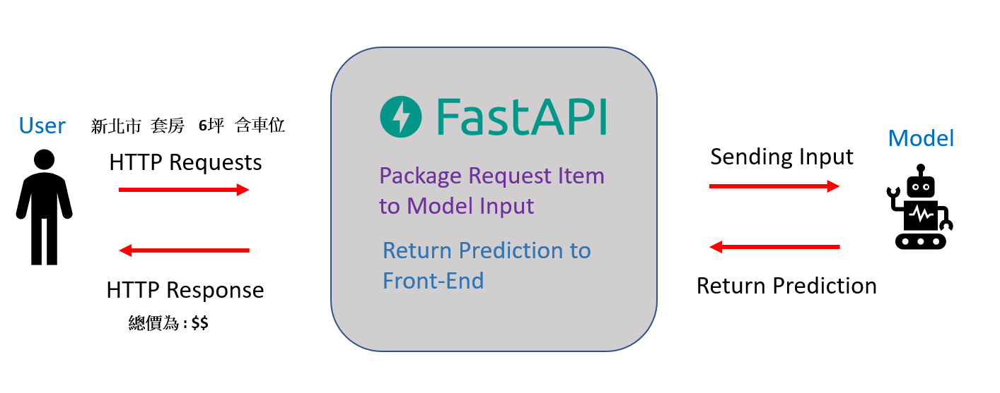

# Houseprice_Predict

房價預測系統

## Project Description

此專案是藉由 政府提供的 實價登錄 資料 來訓練一個Auto-Sklearn Model 藉此預測出 某縣市某一地區 大樓或套房的價格
將Train好的Model 用 FastApi & HTML 建立 Web Application


## 架構圖


更多FastAPi 介紹 可以參考:https://minglunwu.github.io/notes/2021/fast_api_note_1.html


### Quick Start

1. fork the repositories

   ```shell
   git clone https://github.com/ioveeagle/Houseprice_Predict.git
   ```


2. Follow Colab in training to training Model


3. Start development
   +  FastAPi 與 Flask 不同的是，如果直接執行此 main.py 不會啟動服務。需要透過 ASGI Server gvicorn 來啟用
      

### Development

- Setup virtual environment

```shell
python -m venv your-awesome-venv-name
source your-awesome-venv-name/bin/activate
pip install -r requirements.txt
```

- Start Dev Server

```shell
uvicorn app:app --reload
```

### File Description
```
.
├── requirements.txt 
├── app.py  // 專案中的主要組件，所有頁面都在app.py下執行
├── static\js
│   └── test.js
├── templates
│   ├── Home.html  // 網頁首頁
│   ├── Kaohsiung.html  // 高雄
│   ├── NewTaipei.html // 新北
│   ├── Taichung.html  // 台中
│   ├── Tainan.html  // 台南
│   ├── Taoyuan.html  // 桃園
│   └── Taipei.html // 台北
└── training  
    ├── Aiot_model.ipynb  // 訓練模型Colab
    ├── all_data.csv  // 訓練資料
    └── train.py // 練習範本Colab
```

## Training

### DataSet 

https://plvr.land.moi.gov.tw/DownloadOpenData

下圖為台北市資料範例


### Data Preprcessing

1. 從政府的實價登錄資料 整理 挑選有興趣的特徵
   
     + 建材 e.g., 鋼筋、鋼骨
     + 地區 e.g., 南區、西屯區
     + 坪數
     + 主要用途 e.g., 住宅、辦公室

2. 把類別型資料 轉換為數值參數

    

3.  將所有參數與成交價做成資料集，並使用Autosklearn尋找最好的模型和參數 或是挑選幾個較好的模型堆疊，獲得一個效果不錯的模型。


### Result

    MSE score : 4825636.08
    R2 score : 0.7694

## Credit

- [HankyStyle](https://github.com/HankyStyle)
- [ioveeagle](https://github.com/ioveeagle)
- [Rayching](https://github.com/Rayching)
- [huang624](https://github.com/huang624)
- [ms0004284](https://github.com/fcu-d0589769)
